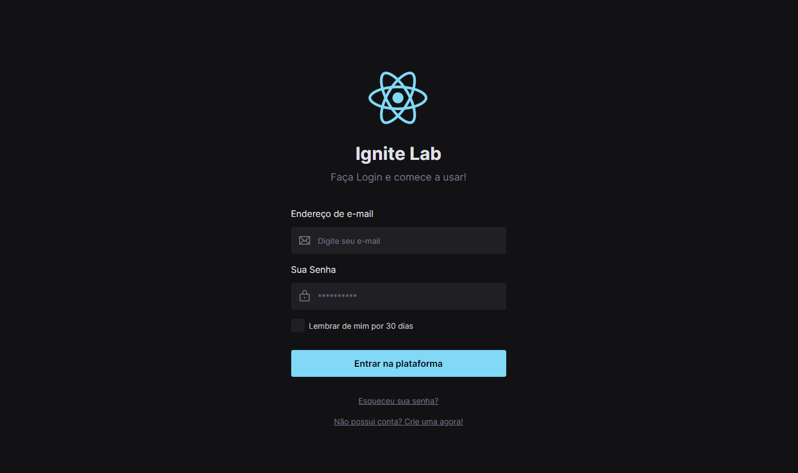

<h1 align="center"> Ignite Lab #01 </h1>

Evento exclusivo e gratuito, promovido pela Rocketseat para ensino de tecnologias WEB.

  <a href="#-tecnologias">Tecnologias</a>&nbsp;&nbsp;&nbsp;|&nbsp;&nbsp;&nbsp;
  <a href="#-projeto">Projeto</a>&nbsp;&nbsp;&nbsp;|&nbsp;&nbsp;&nbsp;
  <a href="#-layout">Layout</a>&nbsp;&nbsp;&nbsp;|&nbsp;&nbsp;&nbsp;

 

  

## 🚀 Tecnologias

Esse projeto foi desenvolvido com as seguintes tecnologias:

- React e TypeScript
- Tailwind CSS e PostCSS
- Figma e Storybook
- [Node e NPM](https://nodejs.org/)
- [Vite](https://vitejs.dev/)

## 💻 Projeto

O IgniteLab consiste em um projeto feito de um Design System montado no Figma, totalmente responsivo e postado diretamente no Storybook, com seus componentes, atributos e testes automatizados.

## 🔖 Layout

Você pode visualizar o layout do projeto através [DESSE LINK](https://www.figma.com/file/Um7TMOQfdWlueX8CrZ0Rxj/Ignite-Lab-Design?node-id=0%3A1). É necessário ter conta no [Figma](https://figma.com) para acessá-lo.
